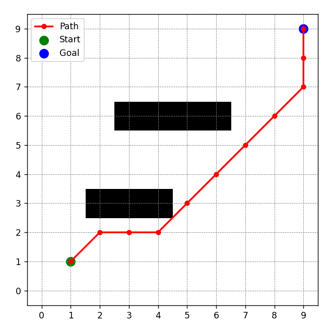
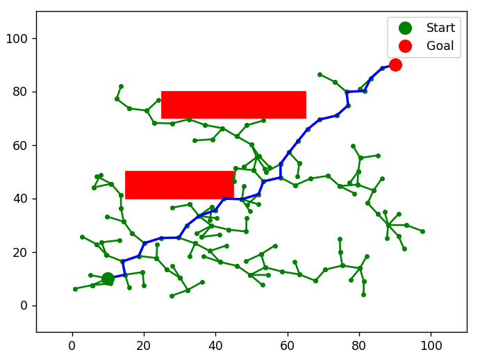

# Path Planning for Autonomous Vehicles

This repository contains different path planning algorithms implemented in Python. Currently, the following algorithms are available:

✅ **A*** (A-star)  
✅ **RRT** (Rapidly-exploring Random Tree)

## 📌 Path Planning Visualization

## A* Algorithm

## RRT Algorithm

## 📖 References

- **A* algorithm**:  
  P. E. Hart, N. J. Nilsson, and B. Raphael,  
  "A Formal Basis for the Heuristic Determination of Minimum Cost Paths,"  
  *IEEE Transactions on Systems Science and Cybernetics*, vol. 4, no. 2, pp. 100-107, July 1968.  
  [DOI: 10.1109/TSSC.1968.300136](https://doi.org/10.1109/TSSC.1968.300136)

- **RRT algorithm**:  
  Huang, G., Ma, Q.,  
  "Research on Path Planning Algorithm of Autonomous Vehicles Based on Improved RRT Algorithm,"  
  *Int. J. ITS Res. 20, 170–180 (2022).*  
  [DOI: 10.1007/s13177-021-00281-2](https://doi.org/10.1007/s13177-021-00281-2)

## ⚙️ How to Run

1. Clone this repository:
   git clone https://github.com/your-repo/path_planning.git
